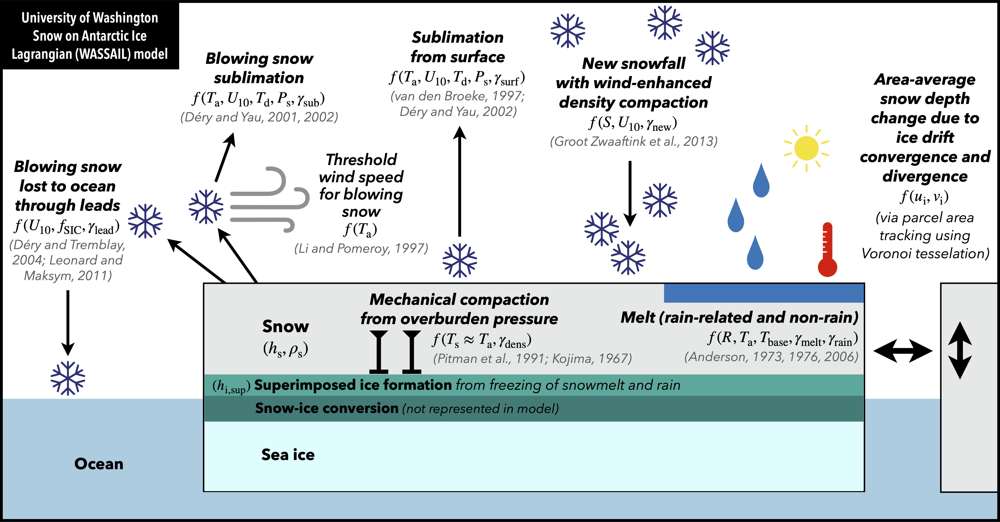

# University of Washington Snow on Antarctic Ice Lagrangian (WASSAIL) model

**This repository contains the model and analysis Python code for Campbell et al. (preprint), "Lagrangian reconstruction of snow accumulation and loss on Antarctic sea ice", submitted to _The Cryosphere_, doi:TBD.**

Please contact me at [ethancc@uw.edu](mailto:ethancc@uw.edu) if you have any questions regarding this code.

### Attribution:
This code is freely available for reuse as described in the MIT License included in this repository. If using this code and/or model data in an academic publication, we encourage you to provide the following citations, as appropriate:
* **Preprint**: Campbell, E.C., Riser, S.C., Webster, M.A. (2026). Lagrangian reconstruction of snow accumulation and loss on Antarctic sea ice. _EGUsphere_ [preprint]. doi:TBD
* **Zenodo code archive**: Campbell, E.C. (2026, April 10). WASSAIL model and analysis code, v1.0. Zenodo. doi:TBD
* **Zenodo model data archive**: Campbell, E.C., Riser, S.C., Webster, M.A. (2026, April 10). University of Washington Snow on Antarctic Ice Lagrangian (WASSAIL) model, v1.0.0 (2003-2025). Zenodo. doi:TBD

### Description:

This repository contains code to run the University of Washington Snow on Antarctic Ice Lagrangian (WASSAIL) model and generate the figures presented in the associated study. The data used to run the model are all publicly available (see the "Code and data availability" statement in the paper). Model output fields are archived separately on Zenodo (see above) and reuse is welcomed.

### Prerequisites:

1. Python 3 and `conda` (or `mamba`) installed. The [Anaconda](https://www.anaconda.com/download) distribution is recommended.

2. A Linux server with at least several cores, for efficient parallelization of multiple one-year model runs. Single-year model runs can be run sequentially within the provided Jupyter notebook, probably on any machine, but the parallelization functionality has not been tested outside of a Linux environment. RAM may become a limiting factor if running the model on a laptop.

### Instructions, part 1 – setting up the code and input data:

1. Clone or download this GitHub repository. Unzip the `wassail.zip` file (e.g., using the command `unzip wassail.zip`), which contains a directory structure and various files.

> Note: In the interest of future reproducibility, the AWI snow buoy calibration/validation data used for the paper (last accessed 1 May 2025) are archived within this `.zip` file, in `Data/Buoys/`, as the data are continuously updated at [their source](https://data.meereisportal.de/relaunch/buoy.php) and a static archive does not appear to exist elsewhere. NSIDC CDR Near-Real-Time sea ice concentration data for part of 2025 are also archived in `Data/Sea ice concentration/CDR_NRT_v3/` and NSIDC Polar Pathfinder 'Quicklook' preliminary ice motion data for 2024-01-01 to 2025-04-01 in `Data/Sea ice drift/`, as these may disappear from NSIDC as data are finalized. The directories additionally contain grid/area files for certain products.

2. Recreate the required Python environment with all dependencies using the provided `wassail.yml` environment file. From within the repository, execute `conda env create -f wassail.yml` (you can also substitute `conda` with `mamba`, if preferred). This will create a new environment called `wassail`. Next, activate the environment using `conda activate wassail`.

3. The directory `Toolbox/` contains the command-line tool `h4toh5`, which converts HDF4 files to HDF5 format. A version for Linux, `h4toh5_linux_centos7`, is provided. If you need a different version for your computing environment, download it [here](https://www.hdfeos.org/software/h4toh5-def-download.php) and update the `exec_filename` variable within the `convert_to_hdf5()` function in the `download_file.py` script.

4. Open and follow the main code notebook `wassail.ipynb`. I strongly recommend using JupyterLab and acquainting yourself with this notebook's structure using the left-side heading navigation pane. (To learn more about how to work with Jupyter notebooks, see [jupyter.org](https://jupyter.org).)

> Note: This single notebook contains almost all of the model and analysis code. The `Toolbox/` directory contains a few `.py` Python scripts with auxiliary "helper" functions, mostly for downloading and loading data. The notebook is documented throughout and is intended to be run from top to bottom, in order to download and process input data, configure the model, run the model (both in "calibration mode" and as "free-running simulations"—see the paper for details), process the output, and visualize/analyze results. Housing the entire model within a Jupyter notebook did create challenges for parallelization, which led to some interesting ad hoc solutions that are described below.

5. Start by running the **"Import statements"** notebook cell. Confirm that the `conda` environment is functioning correctly.

6. In the **"Set file paths and import custom functions"** cell, update the directory names as needed, then execute the cell:
- Under the appropriate system, the variable `data_dir` should be updated to point to the `Data/` directory within this repository.
- The base path for `script_dir` and `this_code_dir` should be updated to reflect the location of this repo on your system.
- `current_results_dir` should be updated to `Results/` within this repo, or a different location on your system for storing output visuals.
- The three sub-directory paths for serialized/processed data must be updated to reflect those in the `Data/Processed/` directory, within this repo. If you want, dates can be added to the directory names for versioning purposes, as shown in the notebook.
- The other various sub-directory paths should be updated only if you wish to use pre-existing input data files downloaded on your system. However, this may require changes elsewhere and is not recommended, since the code processes and re-exports some input data files and thus expects them in a different format than how they were originally downloaded.

> Note: the sub-directory `Data/Processed/wassail_tuning` contains three files. `buoy_split_assignments.csv` denotes the random partioning between the calibration and validation sets of snow buoys used in the current model version. `snow_model_params_tuning.csv` is a table of the parameter values and statistics throughout the calibration routine; recall that the model calibration routine has a stochastic element, so it will generate a different parameter optimization every time it is run. `parcels_input.nc` is a netCDF file containing ERA5 fields interpolated to snow buoy locations (it can be regenerated within the notebook, but is archived here for convenience). This directory also contains sub-directories `rung0` and `rung12` with output files that are helpful for reproducing some of the study visualizations (these can also be reproduced, but not without writing additional code for custom model runs).

7. In the **"Download and process data"** cell, set the boolean variables at the top to `True` to download the corresponding data sets, as needed. I recommend doing this individually, running the cell for each download, and setting the switch back to `False` afterwards. As mentioned above, the AWI snow buoy, NSIDC CDR Near-Real-Time ice concentration, and NSIDC Polar Pathfinder 'Quicklook' ice motion data are provided in `wassail.zip` for reproducibility and do not have to be re-downloaded unless you are running the model over different time periods.

> [!IMPORTANT]
> Note: Some NSIDC download routines will prompt you for your NASA Earthdata login credentials; you will need an account if you do not have one already. You can set the `stored_auth` arguments to `True` if you would prefer to use credentials stored in your `~/.bash_profile` (see `df.nasa_auth()` for more details).

> [!IMPORTANT]
> The ERA5 download routine requires an ECMWF account as well as local installation of a Copernicus CDS API key; see [here](https://cds.climate.copernicus.eu/how-to-api) for how to set this up. If you see "Request is queued" after running the ERA5 download code, you can exit using Ctrl-C. You can track the status of your ERA5 download requests and obtain the download links at [cds.climate.copernicus.eu/requests?tab=all](https://cds.climate.copernicus.eu/requests?tab=all), then use `wget` or similar to download the ERA5 files into `Data/Reanalysis/ERA5/`. Please see the documentation in the notebook for more info. This is the only download routine that does not run fully automatically.

9. Once the ERA5 data have been downloaded, run the final boolean switch (`process_era5`) in the **"Download and process data"** cell to process the ERA5 data. You can delete the files in `Data/Reanalysis/ERA5/To delete/` after it finishes.

10. If you wish to reproduce the snow depth comparison figure or snow-ice formation analysis, download the Fons et al. (2023) CryoSat-2 snow depth estimates at [zenodo.org/records/7327711](https://zenodo.org/records/7327711). The monthly files should go in `Data/Sea ice thickness/Fons_2023_CryoSat2`.

11. Run the next cell, **"Load data/grids and regrid data"**, after setting the boolean switches for `regrid_ice_concentration`, `regrid_pathfinder`, and `regrid_pathfinder_ql` to `True`. This will regrid data to the ERA5 grid, interpolate missing data, and export new files. Note the time estimate for the Polar Pathfinder regridding routine. I suggest setting boolean switches back to `False` after it finishes.

### Instructions, part 2 – setting up and running the model:

12. The next cell, **"Snow model set-up and parameterizations"**, starts with a set of boolean switches that control offline pre-computation and exporting of four ERA5-based fields: 100-h forward-looking wind speed (`reexport_si10_average`), blowing snow sublimation (`reexport_Q_sub`), surface sublimation (`reexport_Q_surf`), and lead trapping (`reexport_Q_ocean`). Set these to `True` and run the cell, then change back to `False`. The processed fields will be stored in `Data/Processed/wassail_era5_derived/`.

> Note: The other boolean values can likely be ignored, unless you prefer for the model to compute these fields on the fly during each run (this is less efficient, except perhaps for one-off/testing runs). The remainder of this cell establishes key model parameters and parameterization functions.

13. The following cell, **"Prescribed model run setup (snow buoys)"**, processes the snow buoy data in preparation for model calibration runs and interpolates ERA5 fields and derived quantities to the buoy locations. Since the pre-processed file `parcels_input.nc` is provided in `wassail.zip`, you can simply load the buoy file by setting `use_existing_parcels_input` to `True` and running this cell. Similarly, setting `use_existing_buoy_split` to `True` will reference the buoy calibration vs. validation assignments used in the paper, as specified in `buoy_split_assignments.csv`, also provided.

> Note: If you wish to regenerate the processed buoy file, set `use_existing_parcels_input` to `False` and run the cell. To regenerate the random buoy split, set `use_existing_buoy_split` to False.

14. The next cell, **"Launch one-time prescribed model run (to interpolate ERA5 to snow buoy locations)"**, does not have to be run if you are using the pre-processed buoy file `parcels_input.nc`.

> [!TIP]
> Even if you are not running this cell, it is instructive in illustrating how the snow model gets executed (and later parallelized), so I recommend taking time to understand the following elements:

- Setting `launch_buoy_interpolator_run` to `True` allows execution (see the inline comments for relevant details).
- The cell uses the `jupyter nbconvert` command-line utility to convert the notebook itself into a separate executable Python script (`.py` extension).
- That script is then launched using another command-line call to `nohup python3`, which allows the job to persist so the model can run in the background. Output is sent to a `.out` file, which you can monitor using command-line tools like `less` to ensure the model is executing without errors. You can monitor the `.out` file or your Linux processes (`top -u <your_username>`) to see when the model finishes running.
- How does the converted `.py` script run without entering a recursive loop of additional model runs? Notice that the `nohup python3` call passes a command-line argument to the script, designating it as a "worker_buoy_interpolator". This argument is checked within the script to signal that it is being run as a "worker" (not from the main Jupyter notebook). It is important to keep boolean switches set to `False` to prevent undesired execution of data download or processing routines by worker jobs. Lastly, notice that a block comment (`"""`) is used to prevent any code following the model code from being run by the Python script, so the calibration routine and analysis code are ignored.

15. The cell **"Lagrangian parcel model"** is the main model code, described thoroughly in the accompanying paper. Some key information:
- You can run the cell within the Jupyter notebook to initialize a one-off, one-year model run, such as for testing purposes. But generally you will not need to run this cell directly. Instead, model runs will be triggered by launching "worker" scripts, as described above.
- The first few sections of the cell contain option switches, inputs, and some model settings. Reference the in-line comments for more details. If changing anything in this cell, keep in mind that it will impact "worker" calibration or free runs launched later in the notebook.
- One useful feature is that the model saves output netCDF files every 7 days, by default, in `Data/Processed/wassail_output_free/<YEAR>/`. The model can be initialized from an output file by setting `restart_from_output = True` and specifying `restart_file`.
- The model code includes an in-development "lock-up" parameterization that limits the snow available for wind transport over time after deposition; this functionality is turned off by default and is not described in the paper.

16. If you do not need to calibrate the model, you can ignore the cell **"Model tuning routine"** and rely on the calibration output file `snow_model_params_tuning.csv` included in `wassail.zip` for the parameter evolution, including the final parameter set. If you are calibrating the model, follow instructions in the in-line comments. This cell uses the same `nohup` command described above, but it runs a separate Python "helper" script, `snow_lagrangian_tuning_launcher.py`, which manages the successive halving calibration routine (see paper for details). The script iterates through each rung of the tuning procedure, launching batches of 56 model runs per rung with Lagrangian parcels following buoy trajectories, until the stopping criterion is reached. The entire procedure occurs automatically.

17. The next few cells can be executed to display the parameter tuning results.

18. Once you are satisfied with the calibration results, executing the **"Model launching routine"** cell will launch one-year free-running model simulations covering the specified range of years. These are full circumpolar integrations with Lagrangian parcels being advected by ice motion fields. Similar to the calibration routine, this set of model runs is launched by a separate Python "helper" script, `snow_lagrangian_free_launcher.py`, and no further action is needed once the cell is run beyond monitoring the status of the runs using the `.out` log files.

### Instructions, part 3 – processing the model output and reproducing analyses:

Note: The following notebook cells, under **"Plots and analysis of results"**, mix model output processing with analysis and visualization. The steps described below focus on how to process the model output.

19. The cells under **"Model output processing and analysis"** serve to translate the model output from the Lagrangian parcel frame to a gridded Eulerian frame.
